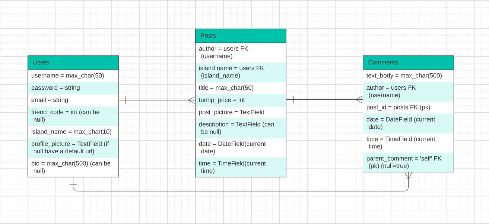

# The Turnip Stalk Market

Introducing a revolutionary new way to exchange turnip prices in Animal Crossing: New Horizons! Say goodbye to scouring endless Reddit forums and Discord channels, and hello to this sleek and user-friendly turnip price exchange web app. Powered by React and Django with Tailwind for styling, this full-stack platform simplifies the process of buying and selling turnips by connecting players in real-time.

Creating an account and signing in is easy - simply register with your email, password, and other information related to your New Horizons island, and you're ready to start. Once logged in, you can create posts advertising your turnip prices to others, inviting them to come to your island and sell. Want to find the best deals? Browse posts from other users and discover the best turnip prices available. Leave comments to coordinate meeting times or just to chat with other players.

With our turnip price exchange web app, buying and selling turnips has never been easier or more convenient. Save time and maximize your profits by joining our community today.

## MVP Goals

Users will be able to:

- Create an account and sign in (have auth)
- CRUD a post to advertise their turnip prices to other users
- Leave comments on other people's posts
- Reply to other users' comments on postings
- Use a "profits" calculator to determine a minimum turnip price needed to produce a profit or to meet your "ROI" goal

## Component Hierarchy Diagram

In progress...

## ERD

## Figma Wireframes

[View my low-fidelity wireframe!](https://www.figma.com/file/6tSHaMxMwT9cy1BukYBahM/Stalk-Market-LO-FI-Wireframes?node-id=0-1&t=ehBmYnca6osJOftE-0)

## Stretch Goals/Post MVP

Users will eventually be able to:

- CRUD their own profile/account
- CRUD comments they have left on posts
- Track their profits over time via a dynamic graph
- Filter postings based on turnip price, date, etc...
- Join a wait queue to visit a user's island; intended for posts with heavy traffic or for users who want to heavily monitor the stream of players going to and from their island
- Follow other users

## Miscellaneous Links

- [Trello](https://trello.com/b/77x2EGYe/capstone-planning-tracking)
- [FigJam Board](https://www.figma.com/file/ubcyqzAvAm1WnMZBxx1gX5/Capstone-Planning?node-id=0-1&t=BzkLfM7aH9DtDxZx-0)

## Get in Contact

- Email: ch.fusco104@gmail.com
- [LinkedIn](https://www.linkedin.com/in/charlottefusco/)
